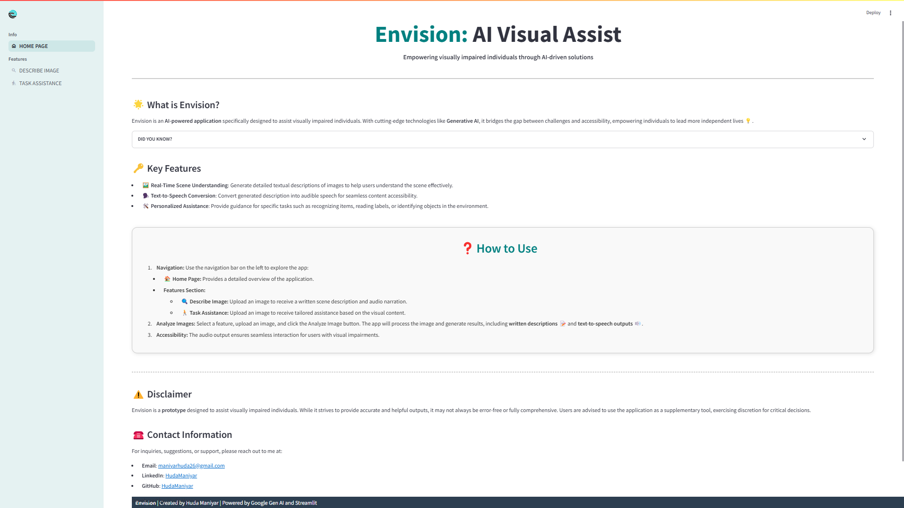

# PYTHON: Envision - AI Visual Assistant

## PROJECT OVERVIEW

Over 2.2 billion people worldwide face challenges with vision impairment, limiting their ability to navigate spaces, read text, or identify objects, which impacts their independence and access to information. 

**Envision** aims to bridge this gap by leveraging AI technologies like LangChain, Generative AI, and Streamlit to provide real-time, voice-assisted image interpretations, enabling visually impaired individuals to navigate their surroundings and perform everyday tasks with greater ease.

 

****

 

## KEY FEATURES
 

**1. Real-Time Scene Understanding**: Generate detailed textual descriptions of images to help users understand the scene effectively.

**2. Text-to-Speech Conversion**: Convert generated description into audible speech for seamless content accessibility.

**3. Personalized Assistance**: Provide guidance for specific tasks such as recognizing items, reading labels, or identifying objects in the environment.

 

## TECHNICAL STACK
 

- :white_check_mark: **Streamlit**: Used to develop the interactive user interface for the application.
- :white_check_mark: **Langchain**: Integrates conversational AI features to enable interactive communication.
- :white_check_mark: **Google Generative AI (Gemini API)**: Powers the generation of scene descriptions and offers personalized support.
- :white_check_mark: **gtts**: Implements text-to-speech functionality, converting text into audible speech.
-	:white_check_mark: **PIL**: Handles image processing tasks, ensuring proper image manipulation and preparation. 
-	:white_check_mark: **Programming Language**: Python

 

## HOW TO USE?
 

**1. Access the App:**
 - Download and SetUp
 - Run the Application using `streamlit run app.py`

**2. Navigate Through the Dashboard:**
  - Use the sidebar to switch between sections like Home and Features (Describe or Task Assistance).

**3.	Upload Image:**
  - Choose an image to upload for processing.

**4.	Click "Analyse Image":**
  - The system will process the image and provide both written and spoken descriptions.

 

## DEMONSTRATION
 

**[Envision - Demo](Envision_AI_Demo.mp4)**

---
 

Please check out the **[Full Report](Envision_AIVisualAssistant_HudaManiyar.pdf)** for Further Explanation! 
\
Your Thoughts and Feedback are highly appreciated! :smile: 
